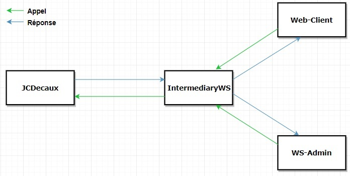

# SI4 : Service oriented computing - Web Services 

## Auteur
Noé MENARD  
Clément DURAND

## Extensions
- Graphical User Interface for the client 

- Functional extensions : En utilisant les API Google et Velib, le client peut selectionner 
une adresse de départ et d'arrivée. Notre application va alors lui renvoyer une GoogleMap
   incluant les stations velibs les plus proches du point de départ et de destination   

* Monitoring : Depuis l'interface administrateur on a accès à plusieurs statistique concernant l'application tels que :     
    * Le nombre de fois que l'api google a été appelée  
    * Le nombre de fois que l'api Velib a été appelée  
    * Le nombre de fois que notre IntermediaryWs a été appelé  
    * Le temps moyen d'une requête envoyé à notre IntermediaryWs
    
Les statistiques sont persistantes et ne sont de ce fait pas perdus si le programme s'arrête.

## Ordre de lancement

 1. IntermediaryWS
 2. Web-Client ou WS-Admin en fonction du besoin
 
 ## Architecture du projet
  1. **IntermediaryWS :** Projet WCF qui met à disposition un service SOAP pour `Web-Client` et `WS-Admin`. D'un autre côté, il communique avec l'API de JC Decaux en REST pour récupérer les informations requises. 
  2. **Web-Client :** Application Web ASP.NET qui communique avec `IntermediaryWS` via un protocole SOAP. Cette application web à deux pages :  
        * La page d'accueil permet de connaître le nombre de vélos pour une station donnée.   
        * La seconde page permet à l'utilisateur de choisir une adresse de départ et d'arrivée. La GoogleMap va alors s'afficher en lui renvoyant le trajet optimal incluant les stations velibs les plus proches du point de départ et de destination. 
  3. **WS-Admin :** Application Windows Form qui communique avec `IntermediaryWS` via un protocol SOAP. Cette interface donne accès à plusieurs statistique concernant l'application.
   
  
       
   
   
## Investissement

Graphical User Interface : 100 % Clément

Functional extensions : 100 % Noé

Monitoring : 50 % Noé +  50 % Clément

Base application : 75 % Noé + 25 % Clément